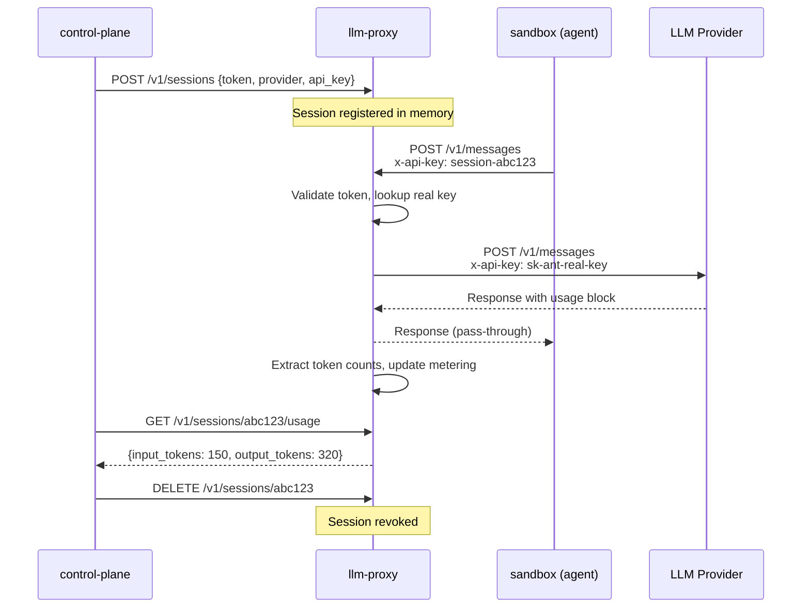
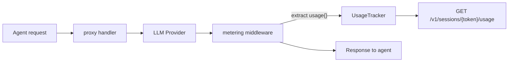

# llm-proxy

A credential-injecting reverse proxy for LLM API calls with built-in token metering. Sits between sandboxed agents and upstream providers (Anthropic, OpenAI, Ollama), swapping session tokens for real API keys on every request. Tracks token usage per session for billing. The sandbox never sees the real credentials.

## System overview

| Repo | What it does |
|---|---|
| **[control-plane](https://github.com/Travbz/control-plane)** | Orchestrator -- config, secrets, provisioning, boot sequence |
| **[llm-proxy](https://github.com/Travbz/llm-proxy)** | This repo -- credential-injecting LLM reverse proxy + token metering |
| **[sandbox-image](https://github.com/Travbz/sandbox-image)** | Container image -- entrypoint, env stripping, privilege drop |
| **[api-gateway](https://github.com/Travbz/api-gateway)** | Customer-facing REST API -- job submission, SSE streaming, billing |

---

## How it works



The proxy is stateless for conversation data -- no history, no storage, no parsing of message content. It validates the token, swaps the auth header, forwards everything, then extracts the `usage` block from the response for metering. Streaming responses (SSE and NDJSON) are flushed immediately with no buffering.

---

## Token metering

Every LLM response passes through a metering layer that extracts token counts from the response body:



Supports both Anthropic and OpenAI response formats:

| Provider | Input field | Output field |
|---|---|---|
| Anthropic | `usage.input_tokens` | `usage.output_tokens` |
| OpenAI | `usage.prompt_tokens` | `usage.completion_tokens` |

Usage accumulates per session token. The [api-gateway](https://github.com/Travbz/api-gateway) polls the usage endpoint when jobs complete to feed into billing.

---

## Provider auth

Each provider has its own auth header format. The proxy handles the translation:

| Provider | Sandbox sends | Proxy injects upstream |
|---|---|---|
| Anthropic | `x-api-key: session-<token>` | `x-api-key: <real-key>` |
| OpenAI | `Authorization: Bearer session-<token>` | `Authorization: Bearer <real-key>` |
| Ollama | Either header format | No auth (local) |

---

## API

### Session registry (called by control-plane)

| Method | Path | Description |
|---|---|---|
| `POST` | `/v1/sessions` | Register a session: `{token, provider, api_key, sandbox_id}` |
| `DELETE` | `/v1/sessions/{token}` | Revoke a session |
| `GET` | `/v1/sessions` | List active sessions (keys omitted) |

### Token metering

| Method | Path | Description |
|---|---|---|
| `GET` | `/v1/sessions/{token}/usage` | Get accumulated token usage for a session |

### Health

| Method | Path | Description |
|---|---|---|
| `GET` | `/v1/health` | Health check |

### Proxy (called by sandboxes)

Everything not matching the above routes goes through the proxy handler. The proxy extracts the session token from `Authorization` or `x-api-key`, looks up the session, and forwards to the upstream provider.

---

## Building

```bash
make build    # builds to ./build/llm-proxy
make test     # runs all tests
make lint     # golangci-lint
make run      # builds and runs on :8090
```

### Quick test with curl

```bash
# start the proxy
./build/llm-proxy -addr :8090

# register a session
curl -X POST http://localhost:8090/v1/sessions \
  -H "Content-Type: application/json" \
  -d '{"token":"my-token","provider":"anthropic","api_key":"sk-ant-...","sandbox_id":"dev"}'

# make a proxied request (as the sandbox would)
curl -X POST http://localhost:8090/v1/messages \
  -H "x-api-key: session-my-token" \
  -H "Content-Type: application/json" \
  -d '{"model":"claude-sonnet-4-20250514","messages":[{"role":"user","content":"hello"}]}'

# check token usage
curl http://localhost:8090/v1/sessions/session-my-token/usage
```

---

## Project structure

```
llm-proxy/
├── main.go
├── pkg/
│   ├── proxy/
│   │   ├── proxy.go             # reverse proxy core
│   │   ├── metering.go          # token usage extraction middleware
│   │   ├── streaming.go         # SSE + NDJSON flush-through
│   │   ├── provider.go          # provider-specific auth injection
│   │   └── provider_test.go
│   ├── session/
│   │   ├── session.go           # Store interface + Session type
│   │   ├── memory.go            # in-memory store implementation
│   │   ├── memory_test.go
│   │   └── usage.go             # UsageTracker interface + MemoryUsageTracker
│   └── server/
│       └── server.go            # HTTP server, routing, registry + usage API
├── docs/
│   ├── architecture.md
│   ├── api-reference.md
│   ├── providers.md
│   └── streaming.md
├── Makefile
├── go.mod
├── .releaserc.yaml
└── .github/workflows/
    ├── ci.yaml
    └── release.yaml
```

---

## Versioning

Automated with [semantic-release](https://github.com/semantic-release/semantic-release) from [conventional commits](https://www.conventionalcommits.org/).
