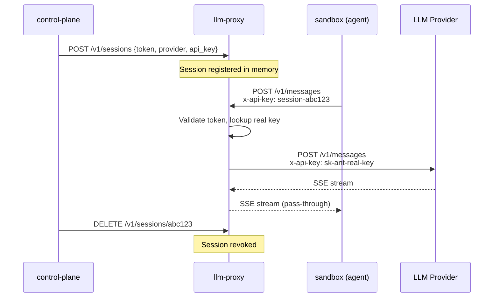

# llm-proxy

A credential-injecting reverse proxy for LLM API calls. Sits between sandboxed agents and upstream providers (Anthropic, OpenAI, Ollama), swapping session tokens for real API keys on every request. The sandbox never sees the real credentials.

Built as part of a three-service agent sandbox system:

| Repo | What it does |
|---|---|
| **[control-plane](https://github.com/Travbz/control-plane)** | Orchestrator -- config, secrets, provisioning, boot sequence |
| **[llm-proxy](https://github.com/Travbz/llm-proxy)** | This repo -- credential-injecting LLM reverse proxy |
| **[sandbox-image](https://github.com/Travbz/sandbox-image)** | Container image -- entrypoint, env stripping, privilege drop |

---

## How it works



The proxy is completely stateless -- no conversation history, no storage, no parsing of request/response bodies. It validates the token, swaps the auth header, and forwards everything verbatim. Streaming responses (SSE and NDJSON) are flushed immediately with no buffering.

---

## Provider auth

Each provider has its own auth header format. The proxy handles the translation:

| Provider | Sandbox sends | Proxy injects upstream |
|---|---|---|
| Anthropic | `x-api-key: session-<token>` | `x-api-key: <real-key>` |
| OpenAI | `Authorization: Bearer session-<token>` | `Authorization: Bearer <real-key>` |
| Ollama | Either header format | No auth (local) |

---

## API

### Session registry (called by control-plane)

| Method | Path | Description |
|---|---|---|
| `POST` | `/v1/sessions` | Register a session: `{token, provider, api_key, sandbox_id}` |
| `DELETE` | `/v1/sessions/{token}` | Revoke a session |
| `GET` | `/v1/sessions` | List active sessions (keys omitted) |
| `GET` | `/v1/health` | Health check |

### Proxy (called by sandboxes)

Everything not matching the above routes goes through the proxy handler. The proxy extracts the session token from `Authorization` or `x-api-key`, looks up the session, and forwards to the upstream provider.

---

## Building

Requires Go 1.25+. If you use Nix, `nix develop` gets you a shell with everything you need.

```bash
make build    # builds to ./build/llm-proxy
make test     # runs all tests
make lint     # golangci-lint
make run      # builds and runs on :8090
```

### Quick test with curl

```bash
# start the proxy
./build/llm-proxy -addr :8090

# register a session
curl -X POST http://localhost:8090/v1/sessions \
  -H "Content-Type: application/json" \
  -d '{"token":"my-token","provider":"anthropic","api_key":"sk-ant-...","sandbox_id":"dev"}'

# make a proxied request (as the sandbox would)
curl -X POST http://localhost:8090/v1/messages \
  -H "x-api-key: session-my-token" \
  -H "Content-Type: application/json" \
  -d '{"model":"claude-sonnet-4-20250514","messages":[{"role":"user","content":"hello"}]}'
```

---

## Project structure

```
llm-proxy/
├── main.go                         # entry point, flag parsing
├── pkg/
│   ├── proxy/
│   │   ├── proxy.go                # reverse proxy core
│   │   ├── streaming.go            # SSE + NDJSON flush-through
│   │   ├── provider.go             # provider-specific auth injection
│   │   └── provider_test.go
│   ├── session/
│   │   ├── session.go              # Store interface + Session type
│   │   ├── memory.go               # in-memory store implementation
│   │   └── memory_test.go
│   └── server/
│       └── server.go               # HTTP server, routing, registry API
├── Makefile
├── go.mod
├── flake.nix
├── .releaserc.yaml
└── .github/workflows/
    ├── ci.yaml                     # lint, test, vet on PRs
    └── release.yaml                # semantic-release on main
```

---

## Versioning

Releases are automated with [semantic-release](https://github.com/semantic-release/semantic-release) from [conventional commits](https://www.conventionalcommits.org/). No manual version bumps.

```
feat: new feature      -> minor bump
fix: bug fix           -> patch bump
BREAKING CHANGE:       -> major bump (in commit footer)
```
