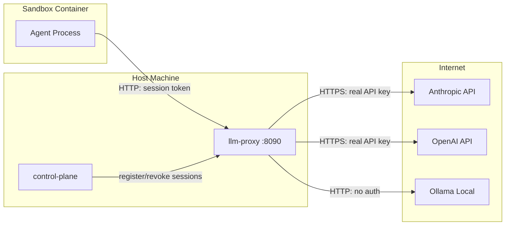
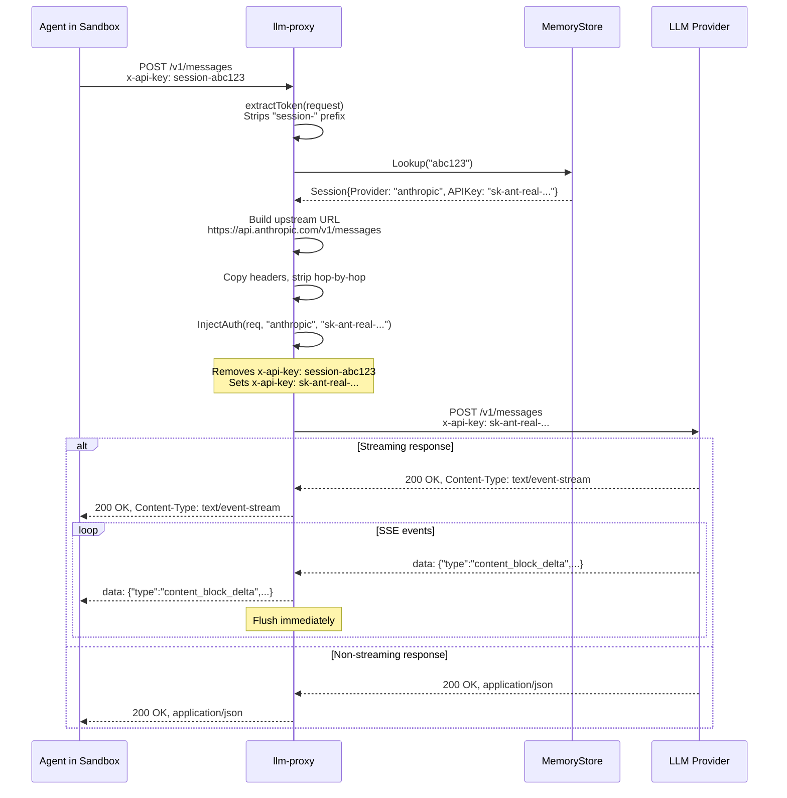

# Architecture

The llm-proxy is a stateless HTTP reverse proxy that sits between sandboxed agents and LLM providers. Its only job is credential injection -- it validates a session token on every request, swaps it for the real API key, and forwards the request upstream. It never stores conversations, never parses request bodies, and never modifies responses.

## Where it sits



The proxy runs on the host machine, not inside the sandbox. The sandbox reaches it via `host.docker.internal` (Docker) or a network route (Unikraft). This is the core of the "isolate the agent" pattern -- the sandbox has no direct internet access for LLM calls. Everything goes through the proxy.

## Request lifecycle

Every request that hits the proxy (except the registry API endpoints) goes through this flow:



## Stateless design

The proxy holds no state beyond the session registry (which is populated externally by the control plane). There is:

- No conversation history. The proxy doesn't know what the agent has said before. It forwards each request independently.
- No request logging to disk. Requests pass through and are gone. If you want telemetry, that's what [tapes](https://github.com/papercomputeco/tapes) is for.
- No response modification. The proxy does not parse, transform, or inspect response bodies. Bytes in, bytes out.
- No retry logic. If the upstream fails, the proxy returns the error to the sandbox as-is.

This means the proxy can restart without losing anything meaningful. The control plane re-registers sessions on reconnect.

## Session lifecycle

Sessions are ephemeral and scoped to a single sandbox run:

1. **Control plane boots a sandbox** -- generates a random session token, registers it with the proxy via `POST /v1/sessions`.
2. **Sandbox runs** -- the agent makes LLM calls using the session token as its "API key". The proxy validates and swaps on every request.
3. **Control plane tears down the sandbox** -- revokes the session via `DELETE /v1/sessions/{token}`. Any subsequent requests with that token get a 401.

If the proxy restarts, all sessions are lost (they're in-memory). The control plane is responsible for re-registering sessions for any running sandboxes.

## Package structure

```
pkg/
├── proxy/
│   ├── proxy.go        # ServeHTTP: the main request handler
│   ├── provider.go     # InjectAuth + DefaultUpstream per provider
│   └── streaming.go    # StreamResponse: flush loop for SSE/NDJSON
├── session/
│   ├── session.go      # Store interface + Session struct
│   └── memory.go       # Thread-safe in-memory implementation
└── server/
    └── server.go       # HTTP mux: registry API + proxy catch-all
```

The separation is intentional. `proxy/` knows nothing about the HTTP server or routing. `session/` knows nothing about HTTP. `server/` wires them together.
