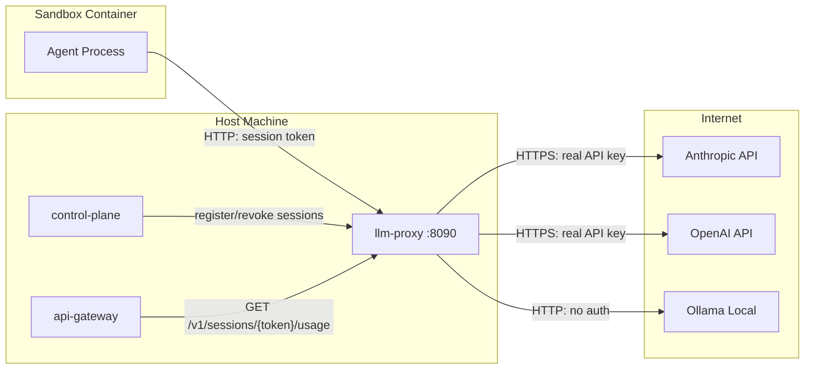
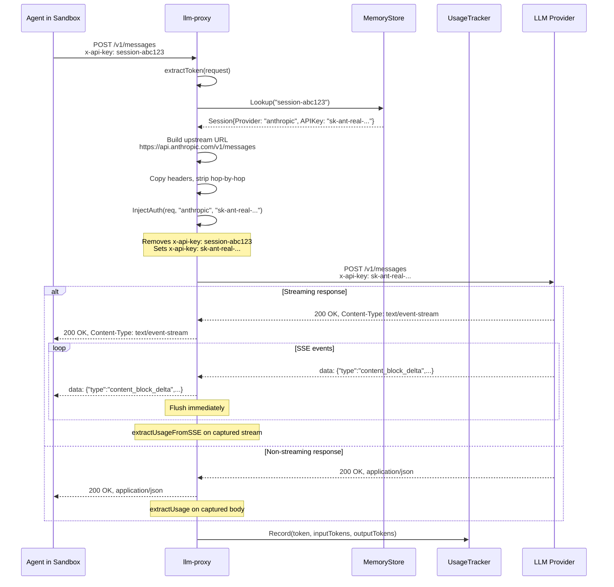
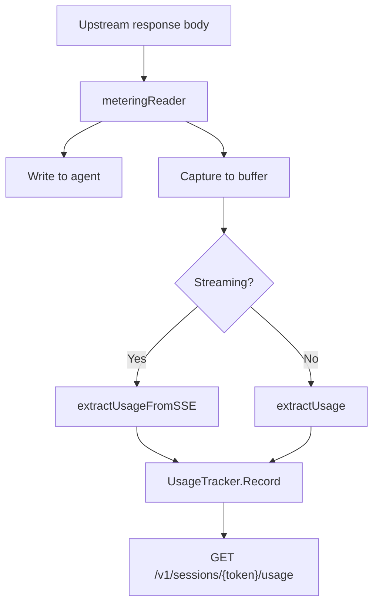

# Architecture

The llm-proxy is a stateless HTTP reverse proxy that sits between sandboxed agents and LLM providers. It does two things: credential injection and token metering. On every request it validates a session token, swaps it for the real API key, forwards the request upstream, then extracts token counts from the response for billing. It never stores conversations, never parses request bodies beyond the usage block, and never modifies the response the agent sees.

## Where it sits



The proxy runs on the host machine, not inside the sandbox. The sandbox reaches it via `host.docker.internal` (Docker) or a network route (Unikraft/Fly). This is the core of the "isolate the agent" pattern -- the sandbox has no direct internet access for LLM calls. Everything goes through the proxy.

The [api-gateway](https://github.com/Travbz/api-gateway) polls the usage endpoint after jobs complete to feed token counts into billing.

## Request lifecycle

Every request that hits the proxy (except the registry and usage API endpoints) goes through this flow:



## Token metering

The proxy wraps every response body in a `meteringReader` that tee-captures the bytes as they flow through. After the response is fully sent to the agent, the captured body is parsed for a `usage` block:



The extraction handles both provider formats:

| Provider | Input field | Output field |
|---|---|---|
| Anthropic | `usage.input_tokens` | `usage.output_tokens` |
| OpenAI | `usage.prompt_tokens` | `usage.completion_tokens` |

For streaming responses, the extractor scans backward through the captured SSE data for the final event containing a `usage` block. Anthropic sends this in a `message_delta` event; OpenAI includes it in the last chunk before `[DONE]`.

Usage accumulates per session token. The `UsageTracker` is thread-safe and tracks input tokens, output tokens, and total request count. Usage data is cleared when a session is revoked.

## Stateless design

The proxy holds no state beyond the session registry and usage counters (both populated/consumed externally by the control plane and api-gateway). There is:

- No conversation history. The proxy doesn't know what the agent has said before. It forwards each request independently.
- No request logging to disk. Requests pass through and are gone. If you want telemetry, that's what [tapes](https://github.com/papercomputeco/tapes) is for.
- No response modification. The proxy does not modify the response the agent sees. The metering reader captures a copy for usage extraction but never alters the bytes flowing to the client.
- No retry logic. If the upstream fails, the proxy returns the error to the sandbox as-is.

This means the proxy can restart without losing anything meaningful (except accumulated usage counters -- the api-gateway should poll periodically if usage data durability matters). The control plane re-registers sessions on reconnect.

## Session lifecycle

Sessions are ephemeral and scoped to a single sandbox run:

1. **Control plane boots a sandbox** -- generates a random session token, registers it with the proxy via `POST /v1/sessions`.
2. **Sandbox runs** -- the agent makes LLM calls using the session token as its "API key". The proxy validates, swaps, forwards, and meters on every request.
3. **Api-gateway polls usage** -- `GET /v1/sessions/{token}/usage` returns accumulated token counts for billing.
4. **Control plane tears down the sandbox** -- revokes the session via `DELETE /v1/sessions/{token}`. Usage data for that token is cleared. Any subsequent requests with that token get a 401.

If the proxy restarts, all sessions and usage counters are lost (they're in-memory). The control plane is responsible for re-registering sessions for any running sandboxes.

## Package structure

```
pkg/
├── proxy/
│   ├── proxy.go        # ServeHTTP: the main request handler + metering integration
│   ├── metering.go     # Usage extraction: extractUsage, extractUsageFromSSE, meteringReader
│   ├── provider.go     # InjectAuth + DefaultUpstream per provider
│   └── streaming.go    # StreamResponse: flush loop for SSE/NDJSON
├── session/
│   ├── session.go      # Store interface + Session struct
│   ├── memory.go       # Thread-safe in-memory session store
│   └── usage.go        # UsageTracker: per-session token counting
└── server/
    └── server.go       # HTTP mux: registry API + usage API + proxy catch-all
```

The separation is intentional. `proxy/` knows nothing about the HTTP server or routing. `session/` knows nothing about HTTP. `server/` wires them together. The `UsageTracker` lives in `session/` because it's keyed by session token, but it's a separate concern from session lookup.
