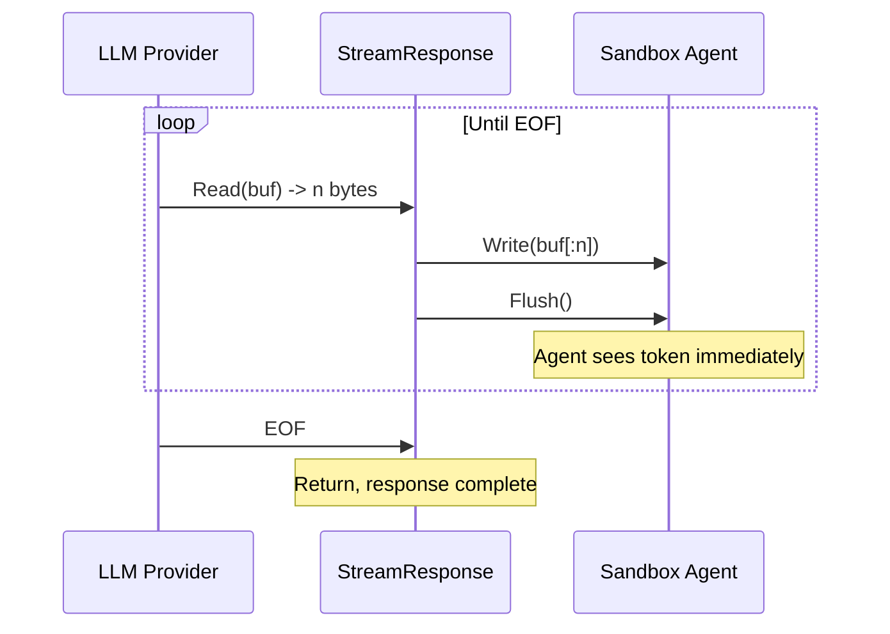

# Streaming

LLM providers stream responses in real time -- tokens arrive one at a time as the model generates them. The proxy handles this transparently without buffering or parsing.

## Streaming formats

| Provider | Format | Content-Type |
|---|---|---|
| Anthropic | SSE (Server-Sent Events) | `text/event-stream` |
| OpenAI | SSE (Server-Sent Events) | `text/event-stream` |
| Ollama | NDJSON (Newline-Delimited JSON) | `application/x-ndjson` |

Both formats are line-oriented, which makes pass-through straightforward.

## How streaming detection works

When the upstream response comes back, the proxy checks three conditions to decide whether to stream:

```go
func isStreamingResponse(resp *http.Response) bool {
    ct := resp.Header.Get("Content-Type")
    return strings.HasPrefix(ct, "text/event-stream") ||
        strings.Contains(ct, "application/x-ndjson") ||
        resp.Header.Get("Transfer-Encoding") == "chunked"
}
```

If any of these match, the response goes through `StreamResponse`. Otherwise, it's a plain `io.Copy`.

## The flush loop

`StreamResponse` in `pkg/proxy/streaming.go` is intentionally simple:

```
read chunk from upstream -> write to client -> flush -> repeat
```

It uses a 32KB read buffer. On every successful write, it calls `Flush()` on the `http.ResponseWriter` (if it implements `http.Flusher`, which all standard Go HTTP servers do). This ensures each chunk of data reaches the client immediately rather than sitting in a write buffer.



There's no special handling for SSE framing (`data:` lines, `\n\n` delimiters) or NDJSON line boundaries. The proxy doesn't need to understand the format -- it just moves bytes. This is important because:

1. **No parsing overhead.** The proxy doesn't allocate per-event. It reads whatever the kernel gives it and forwards it.
2. **No format assumptions.** If a provider changes their SSE format or adds new event types, the proxy doesn't break.
3. **Correct framing is preserved.** TCP guarantees ordering. Whatever chunk boundaries the upstream sends, the client sees.

## Why not use httputil.ReverseProxy

Go's `httputil.ReverseProxy` can handle streaming, but it has opinions about hop-by-hop headers, trailer handling, and error formatting that don't align with what we need. The custom implementation is ~30 lines and gives full control over:

- Which headers are copied (we strip hop-by-hop ourselves)
- How errors are reported (JSON, not plain text)
- Flush behavior (immediate, every chunk)
- The HTTP client configuration (timeout, no redirects)

## Connection lifecycle

The proxy uses a single `http.Client` with a 5-minute timeout. This timeout applies to the entire request-response cycle, including streaming. For very long streaming responses (large context windows, long thinking blocks), this may need to be increased.

The client is configured with `CheckRedirect` returning `http.ErrUseLastResponse` -- if the upstream returns a redirect, the proxy passes it through to the sandbox instead of following it.

## Error handling during streaming

If the upstream connection drops mid-stream:
- `body.Read` returns an error
- `StreamResponse` returns (the loop exits)
- The HTTP handler's deferred `resp.Body.Close()` runs
- The client sees a truncated response

There's no retry. The agent is responsible for handling incomplete responses. This matches what would happen if the agent were calling the provider directly.

If the client (sandbox) disconnects mid-stream:
- `w.Write` returns an error
- `StreamResponse` returns immediately
- The upstream connection is closed by `resp.Body.Close()`
